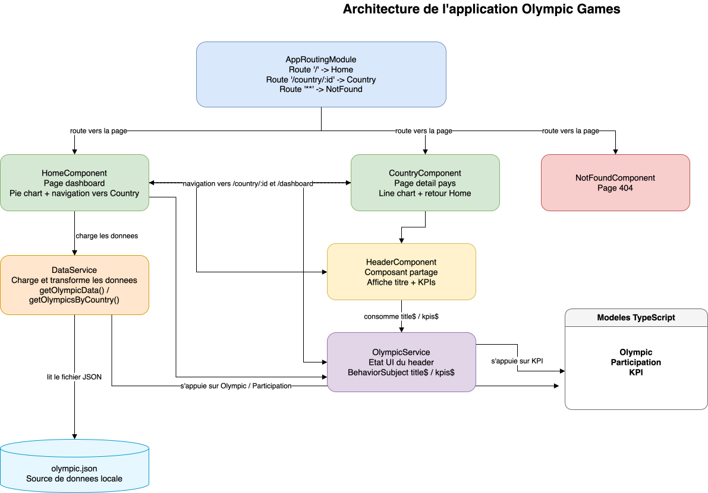

# Architecture du Projet Olympic Games

## 1. Schéma d'architecture

Le schéma ci-dessous présente les blocs fonctionnels de l'application et leurs relations.

Source draw.io : [`docs/architecture-diagram.drawio`](./docs/architecture-diagram.drawio)

## 2. Lecture du schéma

- `AppRoutingModule` gère la navigation entre `HomeComponent`, `CountryComponent` et `NotFoundComponent`.
- `HomeComponent` et `CountryComponent` incluent le composant partagé `HeaderComponent`.
- Les pages consomment `DataService` pour charger les données depuis `olympic.json`.
- `DataService` s'appuie sur les modèles `Olympic` et `Participation` pour typer et transformer les données.
- `HomeComponent` et `CountryComponent` mettent à jour `OlympicService`, qui centralise le titre et les KPIs affichés dans le header.
- `HeaderComponent` s'abonne à `OlympicService`, qui s'appuie sur le modèle `KPI`.

## 3. Rôles des composants

### Pages

Ces composants sont liés aux routes et orchestrent l'affichage.

- **HomeComponent** (`/`) :
  - Affiche le graphique principal (Pie Chart).
  - Récupère les données via `DataService`.
  - Met à jour le titre et les KPIs globaux via `OlympicService`.
  - Inclut `HeaderComponent`.
  - Gère la navigation vers la page de détail d'un pays.

- **CountryComponent** (`/country/:id`) :
  - Affiche les détails d'un pays spécifique (Line Chart).
  - Récupère les données filtrées via `DataService`.
  - Met à jour le titre (Nom du pays) et les KPIs spécifiques (Total athlètes, médailles) via `OlympicService`.
  - Inclut `HeaderComponent`.
  - Gère le bouton "Retour".

- **NotFoundComponent** (`**`) :
  - Affiche un message d'erreur lorsque la route n'existe pas.

### Composants UI

- **HeaderComponent** :
  - Composant partagé utilisé dans `HomeComponent` et `CountryComponent`.
  - N'a **aucune logique métier**.
  - S'abonne à `OlympicService` pour afficher dynamiquement le titre courant et les indicateurs clés.

## 4. Services et gestion des données

L'architecture sépare clairement la **logique de données** de la **logique d'affichage**.

### `DataService`

Ce service est la source de vérité pour les données "froides" (provenant de l'API/Fichier).

- **Rôle** : Récupérer, mettre en cache, filtrer et transformer les données.
- **Méthodes clés** :
  - `getOlympicData()` : Retourne la liste complète des données (Observable).
  - `getOlympicsByCountry(id)` : Retourne les données d'un pays spécifique.
  - `calculateTotalMedals(olympics)`, `calculateTotalAthletes(olympics)` : Méthodes utilitaires pour les calculs.

### `OlympicService`

Ce service gère l'état volatil de l'interface utilisateur.

- **Rôle** : Servir de pont entre les pages (`Home`, `Country`) et le Header. Il évite de devoir passer des données complexe via des chaînes d'événements.
- **Fonctionnement** : Utilise des `BehaviorSubject` pour stocker le titre et les KPIs actuels.
- **Flow** :
  1. `HomeComponent` se charge → appelle `olympicService.updateHeaderData(...)`.
  2. `HeaderComponent` détecte le changement via une souscription et met à jour l'affichage.

## 5. Préparation à une future API Back-end

Cette architecture a été conçue pour faciliter la transition d'un fichier JSON local vers une véritable API REST :

1.  **Abstraction via les Services** :
    Les composants ne savent pas d'où viennent les données. Ils s'abonnent à des `Observable` fournis par `DataService`.
    _Modification future_ : Il suffira de changer l'URL dans `DataService` (`this.http.get('api/v1/olympics')`) sans toucher à une seule ligne de code dans les composants.

2.  **Typage Strict (Interfaces)** :
    L'utilisation d'interfaces (`Olympic`, `Participation`) garantit que si la structure de l'API change, les erreurs de compilation nous avertiront immédiatement des endroits à adapter.

3.  **Gestion Asynchrone (RxJS)** :
    L'application gère déjà les flux de données asynchrones (Observables). L'ajout de latence réseau ou de gestion d'erreurs HTTP réelles (404, 500) s'intègrera naturellement dans les `pipe()` existants du service.
